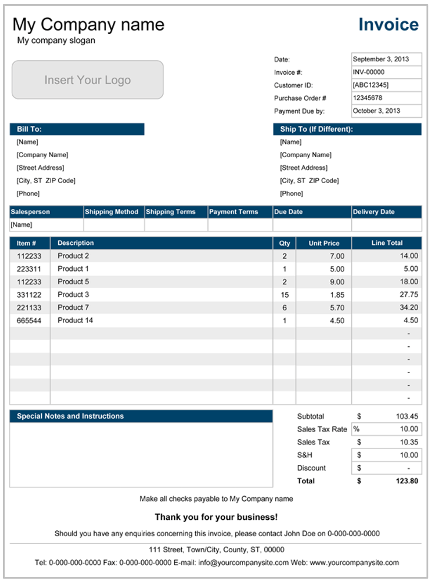

# Customer Invoice

## Purpose

The customer invoice is a financial document created by the supplier that outlines the details of the products or services provided to the buyer. It serves as a formal request for payment and helps in tracking sales transactions.

## Information Required

+ Product or service description
+ Quantity
+ Unit price
+ Total cost
+ Payment terms
+ Seller and Buyer details

## Origins of Information

Derived from the purchase order and freight charges, if any.

**Figure 4:** Sample sales invoice or customer invoice.

