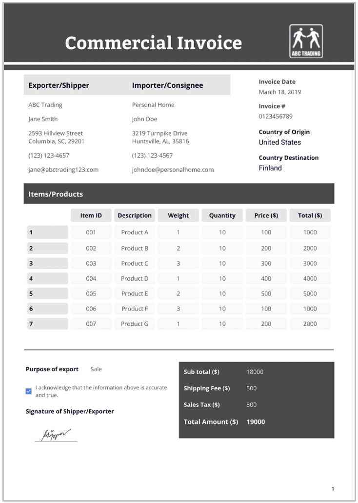

# Packing List

## Purpose

While a customer invoice is normally supplied to the buyer serving as a billing document and record of transaction for accounting and legal purposes, the Commercial invoice usually accompanies the shipment of goods and is provided to customs authorities in both the export and import countries. The commercial invoice provides a detailed breakdown of the transaction value for customs and regulatory purposes and is used by customs authorities to assess duties and taxes. It is also a key document in the shipping and logistics process.

## Information Required

+ Itemized list of products
+ Quantity
+ Weight
+ Dimensions
+ Packaging type
+ Special handling instructions, if any

## Origins of Information

Generated based on the information from the sales order and verified during the packing process.

**Figure 6:** Sample of a packing list.

> ***Note:*** *The nature of a ‘package’ can differ throughout the journey of goods, such as initial packaging from the manufacturer, consolidation into boxes for transport, further consolidation and placing on pallets or in containers for carriers, breakdown (and possibly repacking) for distribution, and further subdivision for sale. For example, the freight forwarder may place the boxes packed by the supplier onto a pallet, and then pack the pallet in a shipping container. Each of these consolidations may trigger additional documentation, but ultimately, they all tie back to the original packing list.*