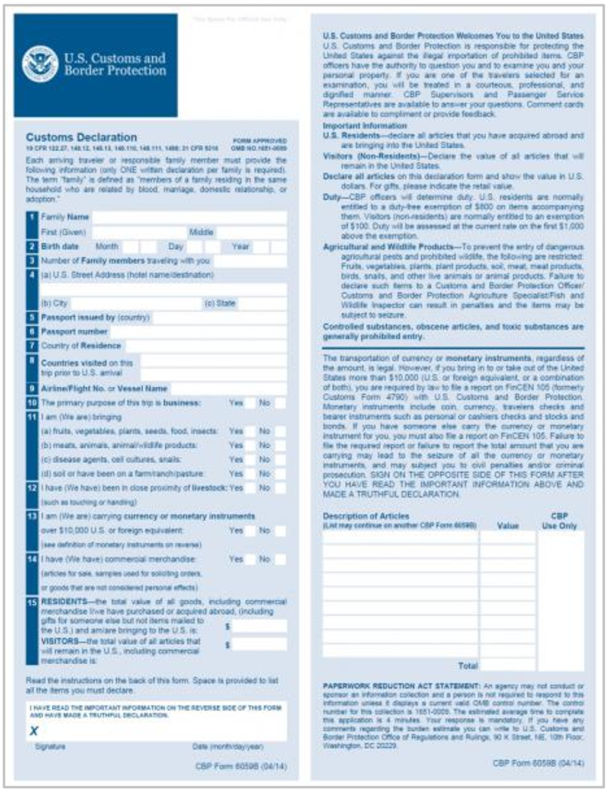

# Customs Declaration Form

## Purpose

Required by customs authorities, this form provides information about the imported goods, facilitating customs clearance.

## Information Required

+ Description of goods
+ Goods commodity classification or Harmonized System code (HS Code or Tariff)
+ Goods use declaration
+ Goods Quantities and Value
+ Origin
+ Applicable concessions
+ Incoterms used
+ Transport and Insurance costs
+ Trade agreement qualification
+ Duty and tax rates

## Origins of Information

Extracted from various supporting documents, such as bills of lading, commercial invoices, technical specifications, and certificates.

**Figure 12:** Sample of the U.S. Customs and Border Protection customs declaration form.

