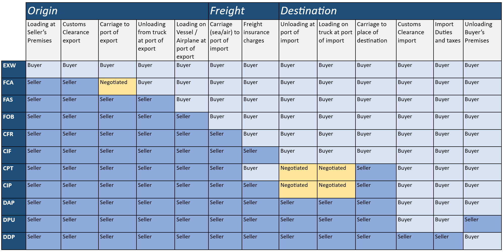

# INCO terms

The International Commercial Terms (Incoterms or INCO terms) are a series of pre-defined commercial terms published by the International Chamber of Commerce (ICC) and widely used in international commercial transactions. The Incoterm rules are accepted by governments, legal authorities, and practitioners worldwide.

A series of three-letter trade terms related to common sales practices, the Incoterms clearly communicate, by task, the allocation of costs and risks associated with the transportation and delivery of goods. The allocation of risk and cost is usually the same, but it is not always the case. However, this level of detail is irrelevant to our purposes and will not be elaborated on here.

## Incoterms Code Descriptions

Following are the Incoterm acronyms along with a brief description of their meaning. Understanding their meaning will assist with understanding which costs impact the Customs value for duty in different countries. For example, in India, the duty is calculated against the CIF value of goods, while in South Africa, the duty is calculated against the FOB value of goods.

**Table 1:** INCO Terms Code Description Table

| INCO Term | Description |  
|---|---|
| **EXW – Ex Works (named place of delivery)** | The seller makes the goods available at their premises or another named place. This term places the maximum obligation on the buyer and minimum obligations on the seller. The Ex Works term is often used while making an initial quotation for the sale of goods without any costs included. |
| **FCA – Free Carrier (named place of delivery)** | The seller delivers the goods, cleared for export, at a named place (possibly including the seller's own premises). The goods can be delivered to a carrier nominated by the buyer, or to another party nominated by the buyer. |
| **FAS – Free Alongside Ship (named port of shipment)** | The seller delivers when the goods are placed alongside the buyer's vessel at the named port of shipment. |
| **FOB – Free On Board (named port of shipment)** | Under FOB terms the seller bears all costs and risks up to the point when the goods are loaded on board the vessel. |
| **FOB – Free On Board (named port of shipment)** | The seller is responsible for origin costs including export clearance and freight costs for carriage to the named place of destination (either the final destination, such as the buyer's facilities, or a port of destination as agreed to by seller and buyer). |
| **CIP – Carriage and Insurance Paid to (named place of destination)** | The seller is responsible for origin costs including export clearance and freight costs for carriage to the named place of destination (either the final destination, such as the buyer's facilities, or a port of destination as agreed to by seller and buyer). In addition, the seller must obtain insurance for the goods while in transit. |
| **CFR – Cost and Freight (named port of destination)** | The seller is responsible for origin costs including export clearance and freight costs for carriage to the named port of destination. The shipper is not responsible for delivery to the final destination from the port (generally the buyer's facilities) or for buying insurance. |
| **CIF – Cost, Insurance & Freight (named port of destination)** | The seller is responsible for origin costs including export clearance and freight costs for carriage to the named port of destination. The shipper is not responsible for delivery to the final destination from the port (generally the buyer's facilities) or for buying insurance. In addition, the seller must obtain insurance for the goods while in transit. |
| **DAP – Delivered At Place (named place of destination)** | All carriage and export customs clearance expenses along with any terminal expenses are paid by seller up to the agreed destination point. The necessary import customs clearance, duties, taxes, and unloading cost at final destination is borne by buyer. |
| **DPU – Delivered At Place Unloaded (named place of destination)** | All carriage and export customs clearance expenses along with any terminal expenses are paid by seller up to the agreed destination point. The necessary import customs clearance, duties, and taxes is borne by the buyer. The unloading cost at final destination, however, is borne by the seller. |
| **DDP – Delivered Duty Paid (named place of destination)** | Seller is responsible for delivering the goods to the named place in the country of the buyer and pays all costs in bringing the goods to the destination, including import duties and taxes. The seller is not responsible for unloading. |

## Allocation of costs to buyer/seller

The below matrix shows who is responsible for the costs of each step in the goods’ journey depending on the agreed Incoterms.

**Figure 13:** Allocation of Costs

