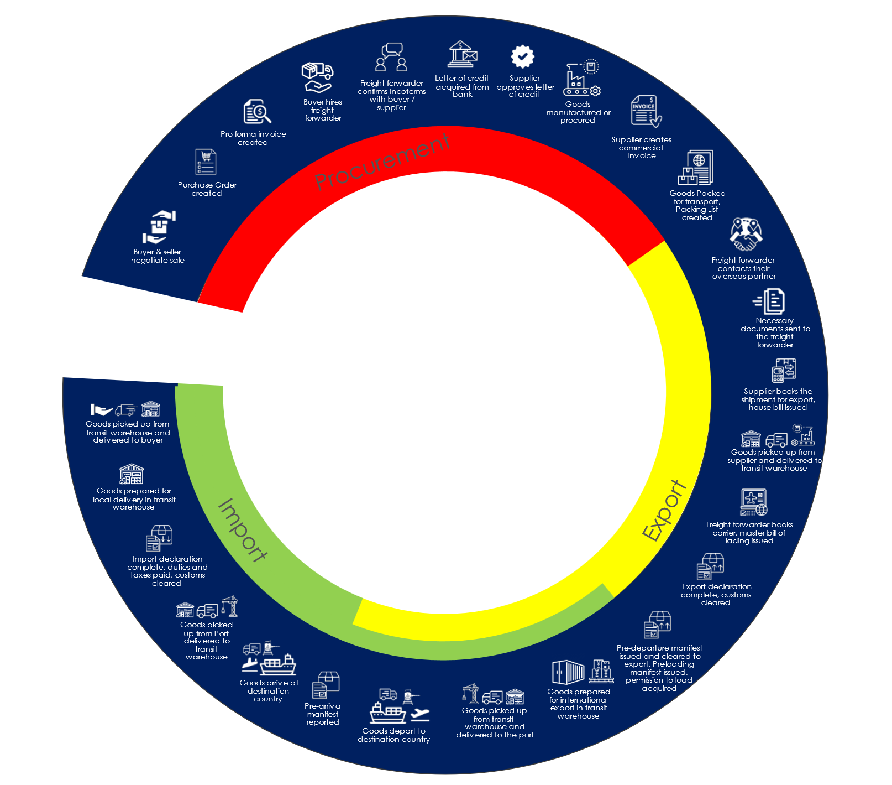

# The Supply Chain

At its core, a supply chain is a complex network of interconnected activities and processes designed to deliver goods from the sources of raw material to the end consumer. It can incorporate the entire journey of a product, from its initial conception and production, storage, distribution, retail, and finally delivered to the place of consumption. In essence, the supply chain is the backbone of global commerce, facilitating the movement of goods through its various stages, across many geographical locations.

Globalization has significantly transformed the landscape of supply chains, expanding their reach but also increasing their complexity. Companies now source materials and components from diverse global locations to capitalize on cost advantages and specialized regional capabilities. While this is beneficial for cost optimization, it also exposes supply chains to various risks, such as geopolitical uncertainties, natural disasters, and other disruptions.

The below diagram demonstrates a simple version of a supply chain. The units of goods moved through the supply chain are either shipments or consolidations.

**Shipment:**  A shipment typically represents a booking by the supplier with a freight forwarder. It normally comprises goods for the same buyer and may cover one or more purchases.

**Consolidation/Consol:** A consolidation, sometimes called a consol, is a collection of shipments. Typically, a consol represents the carrier’s view of the transaction.

It is broadly divided into three phases:

+ [Procurement](#procurement)
+ [Export](#export)
+ [Import](#import)

Each phase involves a series of activities between suppliers, manufacturers, logistics providers, and retailers, all aimed at optimizing efficiency and minimizing costs.

**Figure 1:** The diagram depicts a simple goods movement transaction through the supply chain.

## Procurement

This typically involves purchasing goods and services. In the context of international supply chains, it often includes sourcing suppliers, negotiating contracts, and finalizing agreements. The manufacturing of the goods may or may not be part of the procurement phase, depending on whether the goods purchased already exist or need to be manufactured.

> ***Note:*** *While the freight forwarder is hired to manage the transportation of the goods from the supplier during the procurement phase, they are not normally involved in the sale process and are not part of the procurement process.*

## Export

This phase typically involves all activities related to preparing and shipping the goods from the supplier’s country to the buyer’s country. This includes documentation, customs clearance, and arranging transportation. The export phase typically ends when the goods are loaded onto the conveyance and have left the overseas port.

## Import

This phase begins when the goods depart from the overseas port and nears the entry port of the destination. It involves customs clearance, payment of duties and taxes, and arranging delivery to the agreed place of destination. The Import phase typically ends when the goods are delivered to the agreed place of destination.

## Overlap between Export and Import Phases

There can be some overlap between the Export and Import phases, especially if the destination jurisdiction requires authorizations or permissions before the goods can be loaded onto the conveyance at the origin.

The next sections of this document introduce the key actors and documentation involved in the supply chain. As you proceed through the document, it can be useful to refer to the diagram to understand where each fits into the whole process.