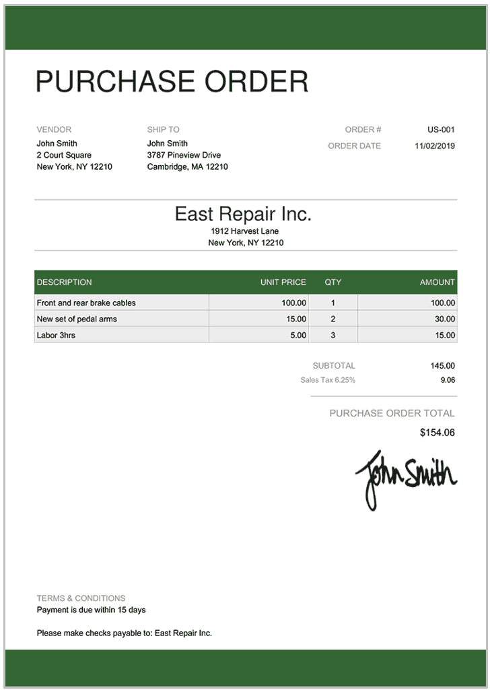

# Purchase Order

## Purpose

The purchase (or sales) order is a financial document created by the buyer that outlines the details of the products or services requested by the supplier. It serves as a formal request for goods and services and helps track sales transactions.

## Information Required

+ Product or service description
+ Quantity
+ Unit Price
+ Total Cost
+ Payment Terms
+ Seller and Buyer Details

## Origins of Information

Derived from the buyer’s demand and the seller’s advertised inventory and pricelist.

**Figure 2:** Sample Purchase Order document.

