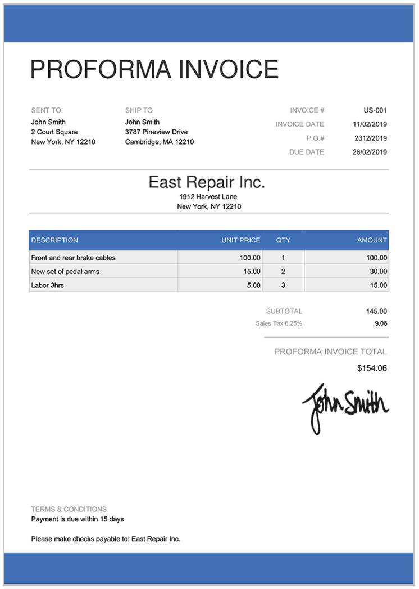

# Proforma Invoice

## Purpose

The proforma invoice is a preliminary bill of sale or estimated customer invoice. It is used to request payment from the committed buyer of the goods or services before they are manufactured or shipped.

## Information Required

+ Product or service description
+ Quantity
+ Unit price
+ Total cost
+ Payment terms
+ Seller and Buyer details

## Origins of Information

Derived from the purchase order.

**Figure 3:** Sample of a proforma invoice.

