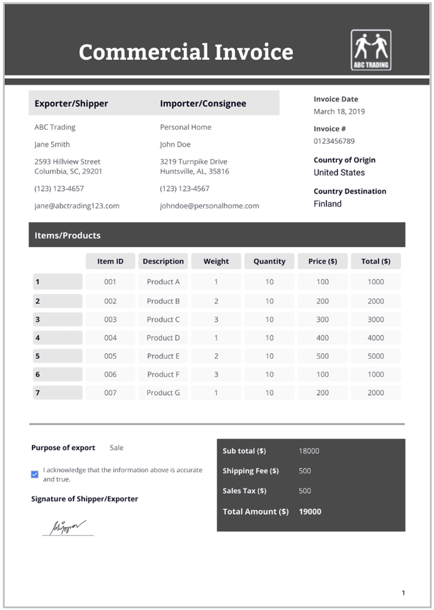

# Commercial Invoice

## Purpose

While a customer invoice is normally supplied to the buyer serving as a billing document and record of transaction for accounting and legal purposes, the Commercial invoice usually accompanies the shipment of goods and is provided to customs authorities in both the export and import countries. The commercial invoice provides a detailed breakdown of the transaction value for customs and regulatory purposes and is used by customs authorities to assess duties and taxes. It is also a key document in the shipping and logistics process.

## Information Required

+ Product description
+ Quantity
+ Unit price
+ Total value
+ Terms of sale

## Origins of Information

Extracted from the sales order and is similar to the customer invoice.

**Figure 5:** Sample of a commercial invoice.

