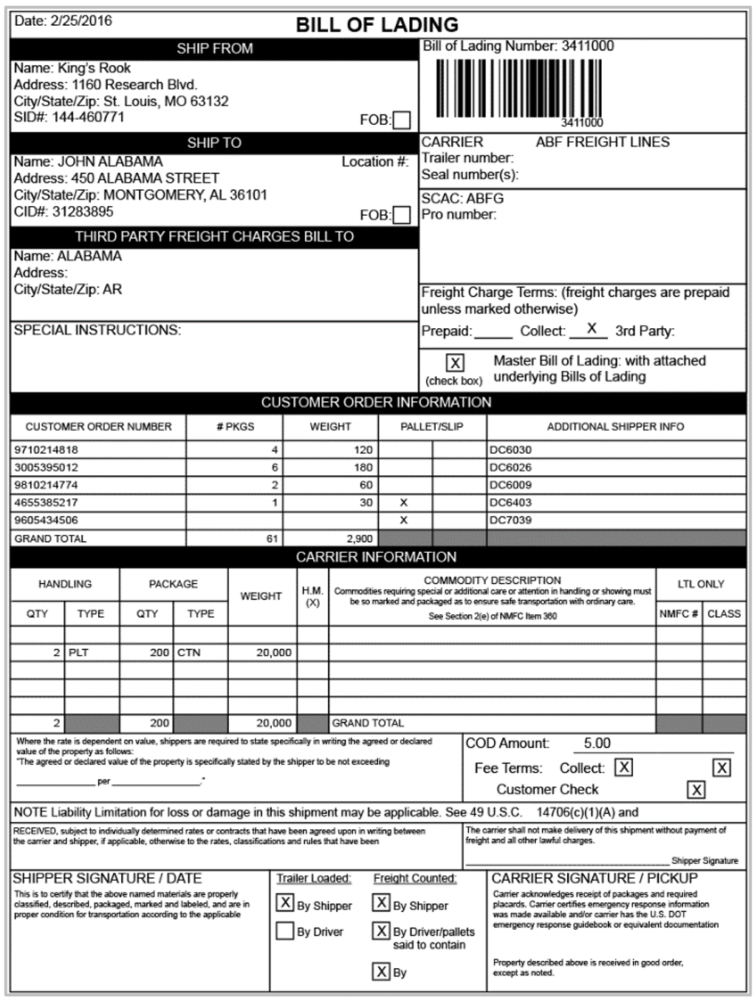
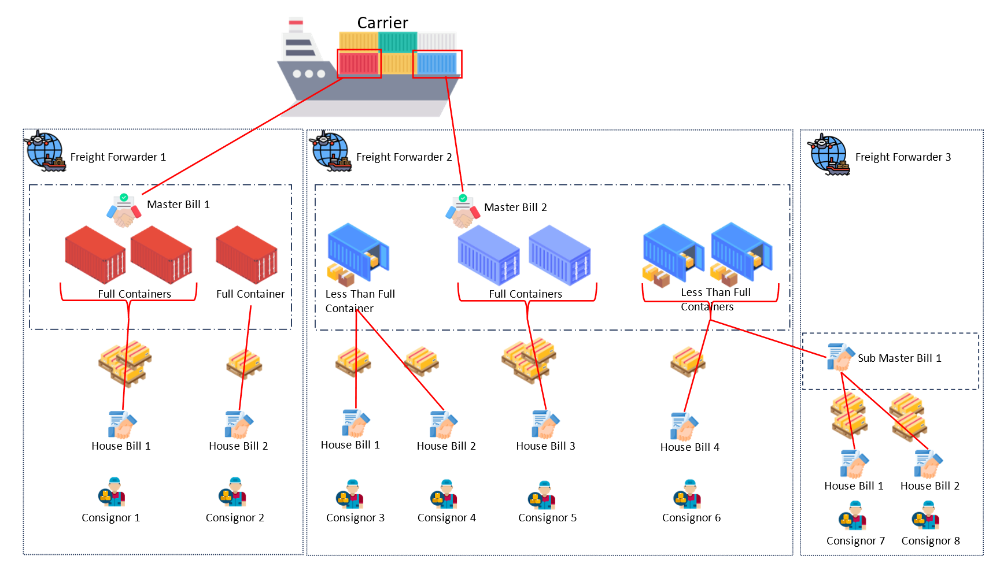

# Bill of Lading

## Purpose

The Bill of Lading serves three purposes. It is a receipt of goods, specifying when and between whom the goods change hands at various journey stages. It is a contract of carriage, establishing the terms of transport—including responsibilities and obligations—between the shipper and carrier. Lastly, it is a document of title, determining ownership (often specified by the Incoterms), which enables the transfer of goods at different points in the supply chain. The Bill of Lading is essential for international shipments and aids in tracking the movement of goods.

## Information Required

+ Details of the shipped goods
+ Consignor and consignee information
+ Shipping route
+ Freight terms
+ Carrier details

## Origins of Information

Gathered from the other related bills of lading (see below), packing list, and transportation contract.

**Figure 7:** Sample Bill of Lading.

## Bill of Lading Types

There are two main Bill of lading types, and each functions as a contract between specific parties involved in the freight movement: the Master Bill of lading (henceforth referred to simply as ‘Master Bill’) is the contract between the carrier (or VOCC) and the freight forwarder (or NVOCC), and the House Bill of lading (henceforth referred to simply as 'House Bill’) is the contract between the freight forwarder (or NVOCC) and the exporter. Both Bill of lading types serve the three purposes stated above.

+ **Master Bill:** The Master Bill, issued by the carrier, represents a contract of carriage between the carrier and the party who booked the cargo, typically the freight forwarder, for a specific voyage/flight. A specific voyage/flight encompasses multiple shipments from various shippers, so a Master Bill typically represents one or more containers or other large shipments. Each voyage/flight generally has multiple Master Bills associated with it.
+ **Master Bill:** The Master Bill, issued by the carrier, represents a contract of carriage between the carrier and the party who booked the cargo, typically the freight forwarder, for a specific voyage/flight. A specific voyage/flight encompasses multiple shipments from various shippers, so a Master Bill typically represents one or more containers or other large shipments. Each voyage/flight generally has multiple Master Bills associated with it.
+ **Sub-Master Bill:** A Sub-Master Bill is an optional Bill type that, if used, is mostly employed in sea freight. It sits between the Master Bill and House Bill and is mostly used when an entity such as a freight forwarder wishes to on-sell prebooked space to another freight forwarder. In this scenario, the Sub-Master Bill is treated as a House Bill issued from freight forwarder ‘A’ to freight forwarder ‘B’, whereas the issued bill is treated as a Master Bill when used by Freight forwarder ‘B’ (who will subsequently issue House Bills to their own clients).

The Master Bill is the parent bill for the House Bills. Understanding this hierarchy of Bills is pivotal, especially when managing consolidated shipments through freight forwarders and coordinating with various stakeholders in the transport process. This hierarchical relationship encompasses a tiered system that delineates the roles and responsibilities of different parties involved, such as shippers, carriers, freight forwarders, and consignees. Recognizing this structure is crucial for effective coordination and seamless communication throughout the transportation and logistics workflow.

**Figure 8:** Relationships between the Master, Sub-Master and House Bills shown in the context of a single voyage. Note that House Bill numbers are not unique. To identify a shipment, both Master Bill and House Bill numbers are required.

For our purposes, we simply need to consider the various levels of Bill types as unique references for the parties involved. For example, the Master Bill is the “job number” used by the carrier, the House Bill and Sub-Master Bill is the “job number” issued by the exporting freight forwarders. To uniquely identify a specific shipment to an interested party, we are required to quote all Bill numbers relating to the individual shipment, e.g., Master Bill ‘ABC001’ and House Bill 'S123’.

## Names According to Mode of Transport

The names of the Master Bill and the House Bill differ slightly depending on the mode of transportation:

+ Air Cargo
    + Master Airway Bill (MAWB)
    + House Airway Bill (HAWB)
+ Sea Cargo
    + Ocean Bill or Master Bill (OBL, MLB)
    + Sub-Master Bill
    + House Bill (HBL)
+ Multiple Modes of Transport
    + Multimodal Bill (MBL)
    + House Bill (HBL)