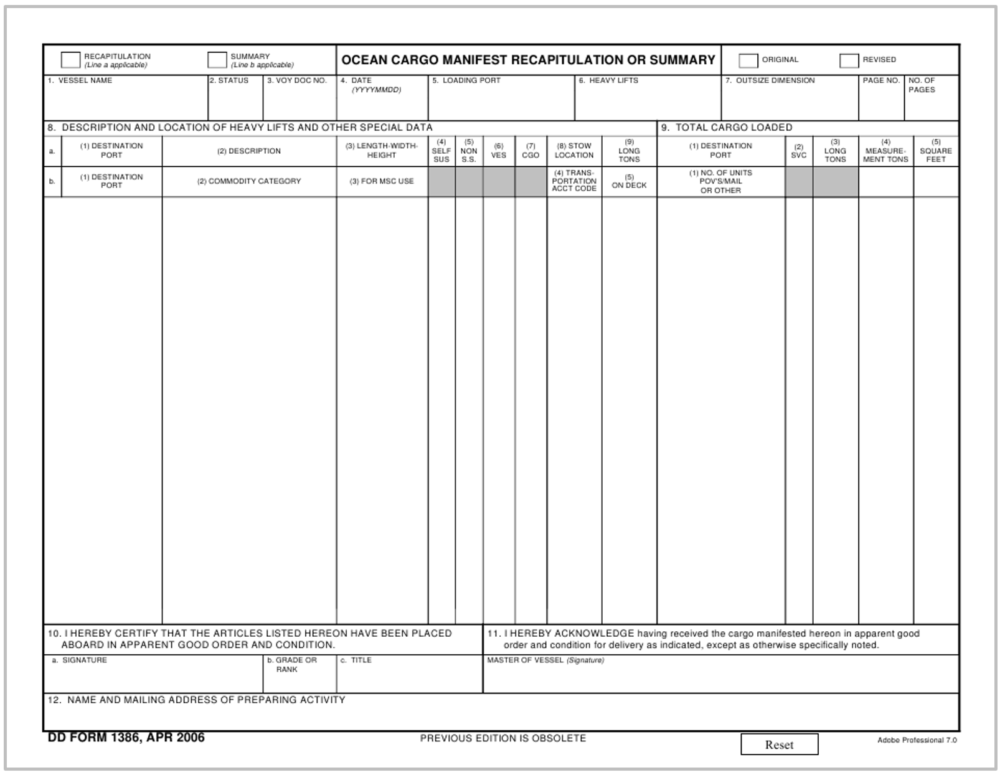

# Manifest

## Purpose

The manifest is a comprehensive list of all shipments on a vessel or aircraft. It assists customs authorities in cargo control and facilitates efficient loading and unloading.

## Information Required

+ Details of each shipment
+ Consignor
+ Consignee
+ Description of goods
+ Weight
+ Volume

## Origins of Information

Compiled from various levels of bill of lading documents and packing lists.

**Figure 9:** Sample ocean cargo manifest document.

