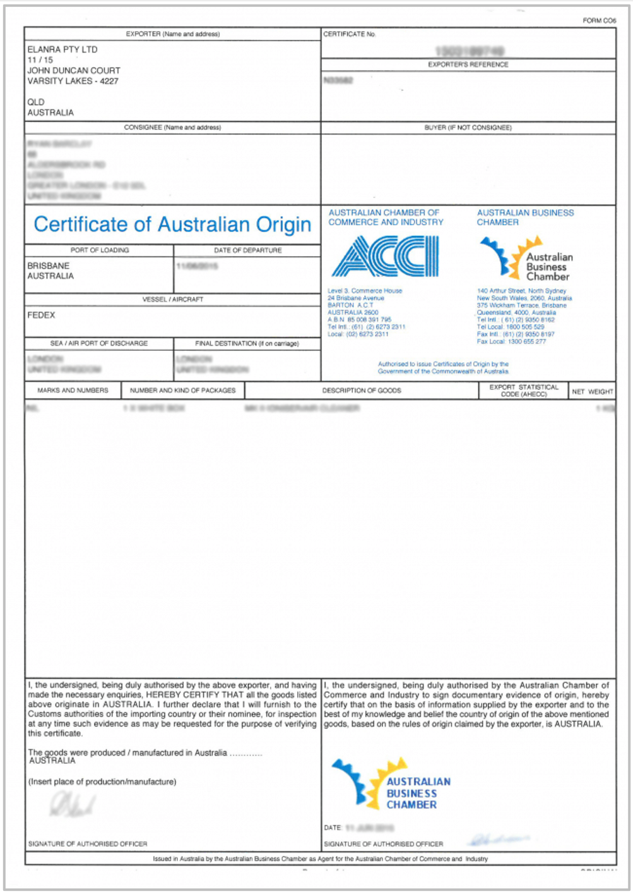

# Certificate of Origin

## Purpose

This document certifies the country where the goods originated. It is essential for determining tariffs and complying with trade agreements.

## Information Required

+ Details of the product
+ Goods origin
+ The exporter's declaration

## Origins of Information

Provided by the exporter based on the manufacturing or production process.

**Figure 10:** Sample certificate of origin.

