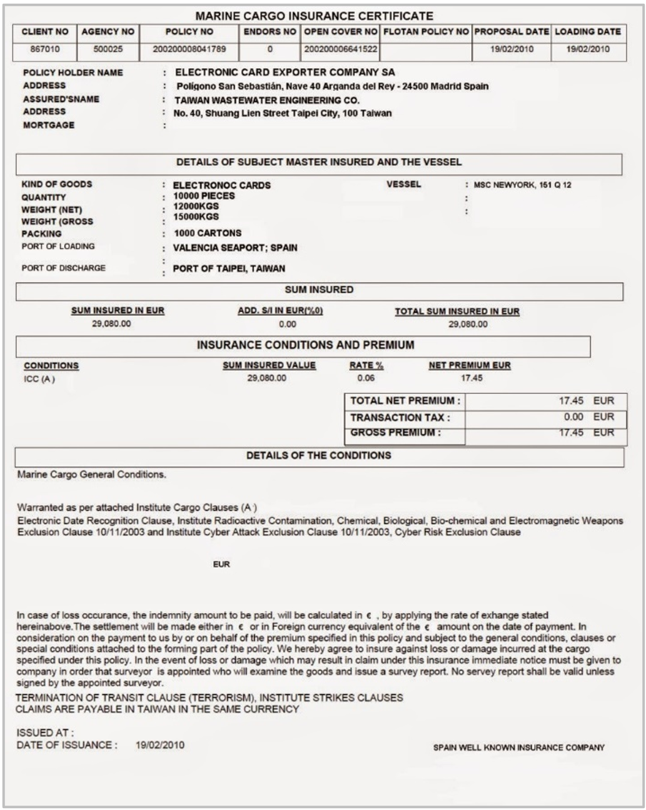

# Insurance Certificate

## Purpose

This document provides evidence of insurance coverage for the shipped goods, offering protection against loss or damage during transit.

## Information Required

+ Details of the insured goods
+ Coverage amount
+ Terms and conditions of the insurance

## Origins of Information

Obtained from the insurance agreement and shipping documents.

**Figure 11:** Sample of a marine cargo insurance certificate.

